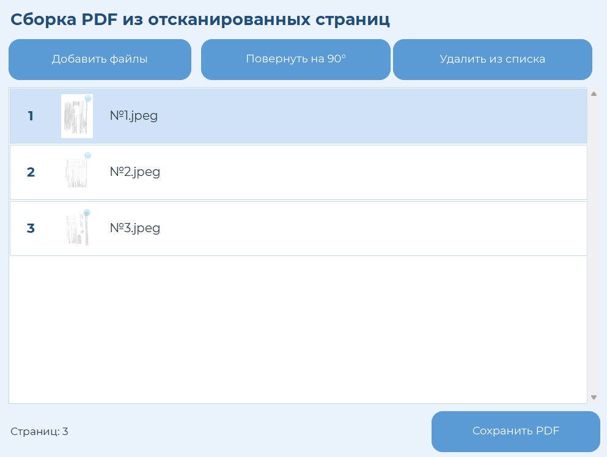

# Scan2PDF

Десктопное приложение на Python для сборки PDF из отсканированных
JPEG-страниц **без потери качества** — с сортировкой страниц через
drag-and-drop, поворотом отдельных страниц и сборкой в один `.exe`
для Windows.


## Главный экран



## Зачем это нужно

Сканер сохраняет каждую страницу документа отдельным JPEG-файлом, и их
нужно вручную собрать в один PDF в правильном порядке. Готовые
онлайн-конвертеры требуют загрузки документов на сторонние серверы и
обычно пересжимают изображения, теряя качество. Scan2PDF решает обе
проблемы: работает локально, без интернета, и встраивает изображения
в PDF побайтово, без перекодирования.

Приложение собирается в один `.exe`-файл и может быть передано на
любой компьютер — без установки Python и зависимостей.

## Возможности

- Добавление нескольких JPEG-файлов через системный диалог выбора.
- Список страниц с миниатюрами и именами файлов.
- Изменение порядка страниц — drag-and-drop мышью с плавающей
  карточкой-превью и индикатором места вставки.
- Поворот отдельной страницы на 90°.
- Удаление страницы из списка без удаления исходного файла с диска.
- Сборка всех страниц в один PDF.

## Технологии

| Назначение            | Библиотека                  |
|-----------------------|------------------------------|
| GUI                   | `tkinter`                     |
| Сборка PDF            | `img2pdf`                      |
| Поворот страниц       | `pypdf`                         |
| Миниатюры и рендер UI | `Pillow`                          |
| Упаковка в `.exe`     | `PyInstaller`                       |

## Как это устроено

Несколько решений, которые могут быть неочевидны при первом взгляде на код:

- **Сборка без потери качества.** `img2pdf` встраивает байты JPEG в PDF
  как есть, без перекодирования. Поворот страницы при этом **не**
  применяется к самому изображению (это потребовало бы пересжатия) —
  вместо этого после сборки PDF дополнительно проставляется флаг
  `/Rotate` на уровне страницы через `pypdf`. Сам JPEG внутри PDF
  остаётся побайтово идентичен исходному файлу.
- **Drag-and-drop.** Перетаскивание страниц реализовано без сторонних
  GUI-библиотек: при перетаскивании создаётся отдельное окно-превью
  (`Toplevel` без рамки), которое следует за курсором, а список
  пересчитывает порядок элементов в реальном времени по координатам
  курсора относительно строк таблицы.
- **Высокий DPI на Windows.** Без явного указания DPI-awareness через
  `ctypes` интерфейс tkinter и системные диалоги выглядят размытыми на
  экранах с масштабированием. Приложение регистрирует себя как
  per-monitor DPI aware при старте.
- **Кастомный шрифт без установки в систему.** Файлы Montserrat
  загружаются во время выполнения через `AddFontResourceExW`, поэтому
  шрифт не нужно устанавливать на компьютер пользователя — он работает
  только в рамках процесса приложения.

## Установка и запуск

```bash
pip install -r requirements.txt
python scan2pdf.py
```

Шрифт Montserrat лежит в папке `fonts/` и подключается автоматически на
Windows. Если файлы шрифта отсутствуют или приложение запущено не на
Windows, используется системный шрифт (Segoe UI).

## Сборка в один `.exe` (Windows)

```bash
pyinstaller --onefile --windowed --name Scan2PDF --add-data "fonts;fonts" scan2pdf.py
```

Готовый файл — `dist/Scan2PDF.exe`. Это самодостаточный исполняемый
файл: можно скопировать на другой компьютер и запустить двойным
щелчком, без установки Python или зависимостей.

## Структура проекта

```
scan2pdf/
├── scan2pdf.py        # основной код приложения
├── fonts/              # файлы шрифта Montserrat
├── requirements.txt    # зависимости
└── README.md
```

## Лицензия

Код проекта распространяется по лицензии MIT (см. `LICENSE`).
Шрифт Montserrat распространяется по лицензии SIL Open Font License.
